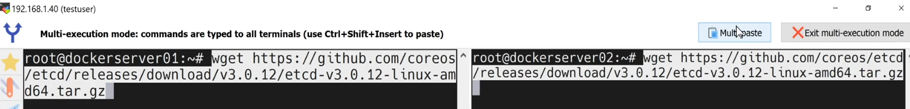

docker network ls

docker inspect bridge

docker inspect -f '{{range .NetworkSettings.Networks}}{{.IPAddress}}{{end}}' nginx-demo1

both nginx-demo1 and nginx-demo2 can talk to-each other since same bridge n/w

=============

How to communicate between two containers in the different bridge network?

Demo

docker network create --subnet 10.10.0.0/16 --gateway 10.10.0.1 database-network
59a6fbea1ae4e4457c02ede4a56bf5e20f53d7427661a67c807f8559714b0027

docker network ls
NETWORK ID     NAME                       DRIVER    SCOPE
fb13b1a0e10f   bridge                     bridge    local
59a6fbea1ae4   database-network           bridge    local
1c0452ce0b9f   host                       host      local
c0ef69af2eb3   none                       null      local
2ca193a30e0a   wordpress-docker_default   bridge    local

docker container run -d --name nginx-test-01 --network database-network nginx
9f5ec490f3b3c039d840b3c9a15ccf9b4a9cddc3b3dd1536d85acf6c36ad4db8

docker container ps
CONTAINER ID   IMAGE     COMMAND                  CREATED          STATUS         PORTS     NAMES
9f5ec490f3b3   nginx     "/docker-entrypoint.…"   11 seconds ago   Up 9 seconds   80/tcp    nginx-test-01
docker inspect -f '{{range.NetworkSettings.Networks}}{{.IPAddress}}{{end}}' nginx-test-01
10.10.0.2
docker container run -d --name nginx-default nginx
b04a0f247647e06929d3c41080053d5398e04e530ae4bc7ca5eb34765b979f1f
docker ps
CONTAINER ID   IMAGE     COMMAND                  CREATED          STATUS         PORTS     NAMES
b04a0f247647   nginx     "/docker-entrypoint.…"   13 seconds ago   Up 5 seconds   80/tcp    nginx-default
9f5ec490f3b3   nginx     "/docker-entrypoint.…"   4 minutes ago    Up 4 minutes   80/tcp    nginx-test-01
docker inspect -f '{{range.NetworkSettings.Networks}}{{.IPAddress}}{{end}}' nginx-default
172.17.0.2

docker container exec -it nginx-default bash
root@b04a0f247647:/# apt update

root@b04a0f247647:/# apt install iproute2 iputils-ping
root@b04a0f247647:/# ping 10.10.0.2
PING 10.10.0.2 (10.10.0.2) 56(84) bytes of data.

# unable to connect 

docker network connect database-network nginx-default
docker container exec -it nginx-default bash
root@b04a0f247647:/# ip a
1: lo: <LOOPBACK,UP,LOWER_UP> mtu 65536 qdisc noqueue state UNKNOWN group default qlen 1000
    link/loopback 00:00:00:00:00:00 brd 00:00:00:00:00:00
    inet 127.0.0.1/8 scope host lo
       valid_lft forever preferred_lft forever
    inet6 ::1/128 scope host 
       valid_lft forever preferred_lft forever
2: eth0@if8: <BROADCAST,MULTICAST,UP,LOWER_UP> mtu 1500 qdisc noqueue state UP group default 
    link/ether 2e:c6:ff:32:dd:83 brd ff:ff:ff:ff:ff:ff link-netnsid 0
    inet 172.17.0.2/16 brd 172.17.255.255 scope global eth0
       valid_lft forever preferred_lft forever
3: eth1@if9: <BROADCAST,MULTICAST,UP,LOWER_UP> mtu 1500 qdisc noqueue state UP group default 
    link/ether 02:9d:e4:6a:e5:35 brd ff:ff:ff:ff:ff:ff link-netnsid 0
    inet 10.10.0.3/16 brd 10.10.255.255 scope global eth1
       valid_lft forever preferred_lft forever
root@b04a0f247647:/# ping 10.10.0.2
PING 10.10.0.2 (10.10.0.2) 56(84) bytes of data.
64 bytes from 10.10.0.2: icmp_seq=1 ttl=64 time=0.195 ms
64 bytes from 10.10.0.2: icmp_seq=2 ttl=64 time=0.061 ms
64 bytes from 10.10.0.2: icmp_seq=3 ttl=64 time=0.068 ms
64 bytes from 10.10.0.2: icmp_seq=4 ttl=64 time=0.082 ms
64 bytes from 10.10.0.2: icmp_seq=5 ttl=64 time=0.063 ms
64 bytes from 10.10.0.2: icmp_seq=6 ttl=64 time=0.130 ms
64 bytes from 10.10.0.2: icmp_seq=7 ttl=64 time=0.062 ms
64 bytes from 10.10.0.2: icmp_seq=8 ttl=64 time=0.075 ms
64 bytes from 10.10.0.2: icmp_seq=9 ttl=64 time=0.066 ms
^C
--- 10.10.0.2 ping statistics ---
9 packets transmitted, 9 received, 0% packet loss, time 8230ms
rtt min/avg/max/mdev = 0.061/0.089/0.195/0.042 ms
root@b04a0f247647:/# 

YOU CAN ALSO DISCONNECT NET Connection

docker network disconnect database-network nginx-default

======================

User defined bridge network with custom sunet/gateway

docker network create webapp-network
77c8f11166aa1ddb0f4fa1003f1d5afeafce4c19e4bd6bbd74f236ad9b717b4f
docker network inspect webapp-network --format '{{range .IPAM.Config}}{{println "Subnet:" .Subnet "Gateway:" .Gateway}}{{end}}'
Subnet: 172.19.0.0/16 Gateway: 172.19.0.1

#delete all user defined n/w
docker network prune
WARNING! This will remove all custom networks not used by at least one container.
Are you sure you want to continue? [y/N] y
Deleted Networks:
wordpress-docker_default
webapp-network

======================

CONTAINERS WITH STATIC IP ALLOCATION

docker network create --subnet 172.30.0.0/16 --gateway 172.30.0.1 my-webapp-net
0fcb4b73c1d57d707d1b61b1469fc0f5f9cfae973da21246e17b0ead6010e822

docker run -d --name nginx01 --net my-webapp-net --ip 172.30.0.10 nginx
0dd6e610d243ae6bd98edf1cc76b998faf3c7d7f686fb05e1e868907834ca84a

docker inspect -f '{{range.NetworkSettings.Networks}}{{.IPAddress}}{{end}}' nginx01
172.30.0.10

SCENE

A IP add trying to assign to 2 containers

docker run -d --name nginx01 --net my-webapp-net --ip 172.30.0.10 nginx
0dd6e610d243ae6bd98edf1cc76b998faf3c7d7f686fb05e1e868907834ca84a

docker inspect -f '{{range.NetworkSettings.Networks}}{{.IPAddress}}{{end}}' nginx01
172.30.0.10
docker run -d --name nginx02 --net my-webapp-net --ip 172.30.0.10 nginx
73234bf87e56cf1a04cc0c327897a6626890ce4edfa33681be2223cd8a9cb550
docker: Error response from daemon: failed to set up container networking: Address already in use.
docker ps -a
CONTAINER ID   IMAGE     COMMAND                  CREATED          STATUS                    PORTS     NAMES
73234bf87e56   nginx     "/docker-entrypoint.…"   12 seconds ago   Created                             nginx02
0dd6e610d243   nginx     "/docker-entrypoint.…"   22 minutes ago   Up 22 minutes             80/tcp    nginx01
ad2d49cf38ab   nginx     "/docker-entrypoint.…"   40 minutes ago   Up 39 minutes             80/tcp    nginx-default01
b04a0f247647   nginx     "/docker-entrypoint.…"   2 hours ago      Up 2 hours                80/tcp    nginx-default
9f5ec490f3b3   nginx     "/docker-entrypoint.…"   2 hours ago      Up 2 hours                80/tcp    nginx-test-01
f43d45344e9a   nginx     "/docker-entrypoint.…"   7 days ago       Exited (255) 7 days ago   80/tcp    nginx-demo2
66f86e11140b   nginx     "/docker-entrypoint.…"   7 days ago       Exited (255) 7 days ago   80/tcp    nginx-demo1
docker container stop nginx01
nginx01

docker container start nginx02
nginx02

1. in user defined network, containers can talk to each other by their IP address,alias name, name of contr

===========================

docker network create --driver host user_defined_host_nw
Error response from daemon: only one instance of "host" network is allowed

===============================================
IMPLEMENTATION OF OVERLAY NETWORK

setup 2 vm in virtual box and install docker on both

Install etcd on both vms

